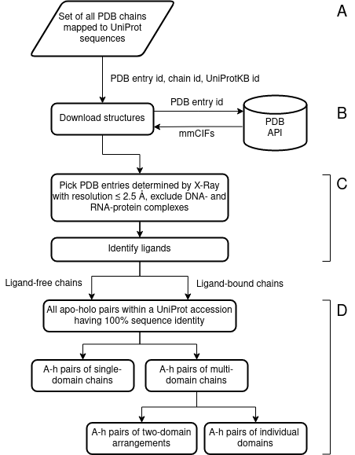

# apo-holo-protein-structure-stats

The purpose of this project is to provide a framework for the comparison of protein structures, namely apo and holo forms
of a protein chain.

Apo and holo forms of a protein are the protein in the absence and presence of a ligand, respectively. The ligand is
usually a small molecule that binds to the protein and can be a drug, a cofactor, or a substrate. It stabilizes the 
protein in a particular structure (conformation), which can alter the protein's activity.

The pipeline downloads the protein structures, filters them (by the resolution for example), detects ligand presence
pairs apo and holo chains with identical sequence, and finally runs analyses such as the RMSD between apo and holo forms,
secondary structure identity, or measures the domain motions.

## Table of contents
- [Installation](#installation)
- [Usage](#usage)
   - [Customization](#customization)
   - [Scripts](#scripts)
   - [Try out the whole pipeline](#try-out-the-whole-pipeline)
- [Results](#results)

## Installation
- Clone the repository `git clone https://github.com/adam-kral/apo-holo-protein-structure-stats.git`
- Create and activate a virtual environment named 'venv' with Python >= 3.8:
    - `python3 -m venv venv`
    - `source venv/bin/activate` on Unix or `venv\Scripts\activate.bat` on Windows
- Install this project `pip install /path/to/repository_root`

This will install the packages as well as the scripts (see below) into the virtual environment. With the virtual environment activated, you can then import this project in your code, and run the scripts in shell anywhere in your system.

## Usage
The pipeline consists of six scripts implementing the multistep pipeline as in the flowchart below.



See how to run the whole pipeline [below](#try-out-the-whole-pipeline).

### Customization

The constants of the default implementation (minimum resolution, ligand definition, etc.) are customizable, by
settings env var `AH_SETTINGS_FILE` with path to the settings yaml file. See
[settings module](apo_holo_structure_stats/settings.py),
[sample_settings.yaml](apo_holo_structure_stats/sample_settings.yaml).

Filtering logic, adding columns to the json output such as ligand binding state; pairing logic, (todo analysis logic)
are all customizable, also beyond pairing and comparing _apo-holo_ chains. Set `Settings.FILTER_STRUCTURES_CLASS`, or `Settings.MAKE_PAIRS_CLASS` to your subclass of
the default implementation. See [ah-filter-structures module](apo_holo_structure_stats/pipeline/filter_structures.py),
[ah-make-pairs module](apo_holo_structure_stats/pipeline/make_pairs_lcs.py).

You can import from the `apo_holo_structure_stats` in your code.

### Scripts
The description of the pipeline scripts will follow.

Arguments for the scripts can be shown by running the script with `--help` flag.

#### ah-chains-uniprot


Collect PDB chains with their uniprot ids.


By default all PDB chains are collected (which are in the SIFTS service).
Output fields are: pdb_code, chain_id, uniprotkb_id, uniprot_group_size
    where uniprot_group_size is the number of chains in the PDB that have the same uniprot id.

Data are obtained from SIFTS' uniprot_segments_observed.csv file.

Usage:
    ah-chains-uniprot chains.json
    ah-chains-uniprot --chains <chains_without_uniprot>.json chains.json
    ah-chains-uniprot --uniprot_ids P12345,P12346 chains.json
    ah-chains-uniprot --limit_group_size_to 10 --seed 42 chains.json


#### ah-download-structures


Download structures from the PDB.


Files will be downloaded to the Settings.STRUCTURE_STORAGE_DIRECTORY.
Other scripts will automatically use this directory for loading the structures.

Usage:
    ah-download-structures -v --workers 10 chains.json  
     ah-download-structures -v -i pdb_codes 1abc,2abc                                             


#### ah-filter-structures


  Filters structures and extracts metadata using the parsed mmcif structures.

To modify the script functionality, you can inherit class StructureProcessor. 


To modify the script functionality, you can inherit class StructureProcessor (see its docstring), and then set 
Settings.FILTER_STRUCTURES_CLASS to your descendant. 

The structures and chains are (by default) filtered according to the following criteria:
- only structures with resolution <= Settings.MIN_STRUCTURE_RESOLUTION are kept
    - where there must be a field "_refine.ls_d_res_high", "_refine_hist.d_res_high", or 
    "_em_3d_reconstruction.resolution" in the mmcif set
    - therefore the kept structures are only X-ray or EM structures
- (chains with microheterogeneity in the sequence are skipped) https://mmcif.wwpdb.org/dictionaries/mmcif_std.dic/Categories/entity_poly_seq.html
- only chains with at least Settings.MIN_OBSERVED_RESIDUES_FOR_CHAIN amino acid residues are kept

The metadata about the chains are added to the JSON file with the following fields (by default):
- `sequence` of the chain is retrieved from the mmcif file (3-letter codes); used in ah-make-pairs
- `is_holo` is true if the chain has ligand bound to it (see Settings.LigandSpec); used in ah-make-pairs
- (`resolution`, `_exptl.method`, and `path` to the file)

Usage:
    ah-filter-structures.py -v chains.json filtered_chains.json                         


#### ah-make-pairs


 Pair chains for subsequent structural analyses of the pairs.

Default impl. computes the longest common substring for all potential apo-holo pairs within a uniprot accession.


To modify the behavior of this script, set Settings.MAKE_PAIRS_CLASS to your subclass of Matchmaker.

Creates JSON with records for each potential pair (within a uniprot accesion) with fields:
- pdb_code_apo, chain_id_apo, pdb_code_holo, chain_id_holo, lcs_result (see LCSResult class)
- use `load_pairs_json` to load the JSON into a pandas.DataFrame and `pairs_without_mismatches` to filter out
potential pairs with mismatches leading or trailing the LCS.


#### ah-run-1struct-analyses


 Obtain domains and secondary structure for (the already paired) structures.

This script obtains it, given the pdb_codes in the pairs json,  using the pdbe-kb API.
It is not extensible (but could be), currently
users are expected to use their data gathering scripts to obtain additional data they need in run_analyses.py.

There are much fewer apo-holo paired structures than in the whole pdb and the APIs "rely on user restraint".


#### ah-run-analyses


Compares chains given the pairs.


Currently not extensible. Users can write their own script, similar to this one, or redefine `configure_pipeline` function for smaller changes.


### Try out the whole pipeline
```shell script
ah-chains-uniprot -v --uniprot_ids P14735 chains.json
ah-download-structures -v --threads 6 chains.json
ah-filter-structures -v --workers 4 chains.json filtered_chains.json
ah-make-pairs -v --workers 4 filtered_chains.json pairs.json
ah-run-1struct-analyses -v pairs.json
ah-run-analyses -v pairs.json
```


## Results
- reproducing the paper + citation (also into)
- verifying (notebook link)
- results on whole pdb gzip json link
- notebook link whole pdb + todo refactor

[verifying](apo_holo_structure_stats/paper_repl/paper_plots.ipynb) of reproducing [Brylinski and Skolnick (2008)](https://doi.org/10.1002/prot.21510)
First, we reproduced the results of [Brylinski and Skolnick (2008)](https://doi.org/10.1002/prot.21510), <sup>[pdf](http://cssb.biology.gatech.edu/skolnick/publications/pdffiles/273.pdf)</sup>. Next, we obtained the results for the up-to-date PDB.

todo detailed - what is measured, ligand definition etc. (copy from thesis? Add link to a pdf with this info?)
